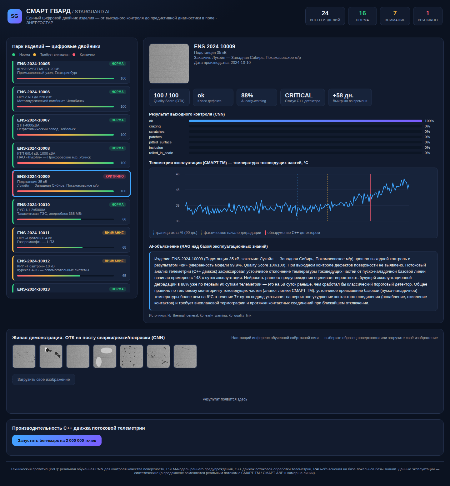

# Smart_Guard_AI

[Русский](README.md) · [English](README.en.md) · [中文](README.zh.md) · [हिन्दी](README.hi.md) · [Español](README.es.md) · [Français](README.fr.md) · **Deutsch** · [Italiano](README.it.md)

Labor-PoC zur Verbindung von Qualitätsprüfung und Zustandsüberwachung über Seriennummern. Ergänzendes Portfolio-Projekt ohne geplante Erweiterung. Bilder und Telemetrie sind synthetisch; Industrieeinsatz und Nutzen sind nicht belegt.



## Architektur

Eine PyTorch-CNN klassifiziert prozedurale Oberflächendefekte und erzeugt Quality Score. Der LSTM-Prototyp nutzt Telemetrie und qualitätsbezogene Eingaben. C++17 verarbeitet Telemetrie; FastAPI liefert digitale Produktpässe und ein HTML/CSS/JS-Dashboard. Erklärungen entstehen durch lokale Suche und Textvorlagen, ohne externes LLM.

## Start und Prüfung

Befehle im Repository-Hauptverzeichnis ausführen. Python-Abhängigkeiten sind nicht vollständig fixiert. Training und Flottengenerierung überschreiben Artefakte; zum Erhalt vorhandener Modelle eine separate Kopie verwenden. Dashboard: http://localhost:8000.

```sh
python3 -m venv .venv
.venv/bin/pip install -r requirements.txt
cmake -S backend/cpp -B backend/cpp/build -DCMAKE_BUILD_TYPE=Release
cmake --build backend/cpp/build -j2
.venv/bin/python -m unittest discover -s tests -v
.venv/bin/python -m uvicorn app:app --app-dir backend --host 127.0.0.1 --port 8000
```

## Optionale Neugenerierung

```sh
cd backend/ml
../../.venv/bin/python generate_dataset.py
../../.venv/bin/python train_defect_model.py
../../.venv/bin/python train_predictive_model.py
../../.venv/bin/python simulate_fleet.py
```

## Nachweisgrenzen

Quality Score und spätere Ausfälle sind eine Forschungshypothese. Genauigkeit, weniger Stillstand/Reklamationen und wirtschaftlicher Nutzen erfordern unabhängige Auswertung realer Daten. Standortnamen belegen keine Installation. lead_time_days_vs_classic zieht den festen Tag 90 vom Schwellwerttag ab; keine Messung des ersten sequenziellen Modellalarms. Seeds nutzen SHA-256 statt Python hash(); alte Gewichte/Metriken gehören ohne neues Training und Auswertung nicht zum geänderten Dataset. C++ --bench misst eine Speicherschleife, keinen Gesamtdurchsatz oder industriellen Edge-Einsatz.

## Dokumentation

Kompakte übersetzte Anleitungen; ausführliche Beispiele im russischen README. Oberfläche und Erklärungen bleiben unverändert. Normal-Smoke und Bildreproduzierbarkeit validieren keine CNN/LSTM-Genauigkeit, RUL oder Produktionswiederherstellung.

[Русский](README.md)
