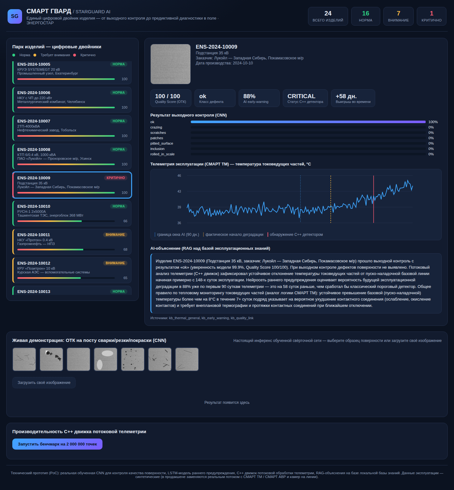

# Smart_Guard_AI
### AI-платформа сквозного контроля качества и предиктивной диагностики

Технический прототип (PoC).Показывает, как объединить два актива компании - металлообработку (выходной контроль) - в единый ИИ-продукт.

> **Дисклеймер:** это не слайд с идеей, а работающий прототип - обученные нейросети, и линейку промышленных контроллеров телеметрии (мониторинг в эксплуатации) - в единый ИИ-продукт.

> ⚡ **Дисклеймер:** это не слайд с идеей, а работающий прототип - обученные нейросети,
> C++ движок реального времени, живой дашборд. Поднимается одной командой за 5 минут. Синтетические только данные ОТК и
> телеметрии - код, модели и архитектура настоящие.



---

## 1. Идея

Каждое изделие получает **цифровой паспорт по серийному номеру**. На производстве
свёрточная нейросеть (CNN) находит дефекты поверхности и присваивает Quality Score;
в эксплуатации телеметрия анализируется потоковым C++ движком и
нейросетью раннего предупреждения (LSTM), которая явно использует Quality Score
как один из факторов риска. Контур замыкается: производство подсказывает
эксплуатации, где ждать проблем, а эксплуатация подтверждает/уточняет, какие
дефекты производства реально влияют на надёжность.

## 2. Зачем это компании?

| Проблема сейчас | Что даёт СМАРТ ГВАРД | Эффект |
|---|---|---|
| Брак/несоответствия ловятся визуально, постфактум | CNN-контроль на постах резки/сварки/покраски, 96% точность на валидации | Меньше рекламаций, меньше переделок, объективные данные для конкурентного УТП «+130% долговечности» |
|  продаются как разовое железо | Тот же поток данных превращается в сервис предиктивной диагностики | Новая статья recurring-revenue — платная подписка на мониторинг поверх уже проданного оборудования |
| Аварии обнаруживаются, когда порог уже превышен | LSTM видит слабый тренд по первым 90 дням эксплуатации — в демо-кейсе предупреждение приходит на **58 дней раньше** порогового детектора | Время на плановое, а не аварийное обслуживание — экономия на простоях и внеплановых выездах |
| Гарантийные споры разбираются без данных о том, как деталь была произведена | Serial-number-трассируемость от сварочного поста до объекта заказчика | Быстрее разбор рекламаций, аргументы в спорах с заказчиком |
| Инженеры тратят время на объяснение алертов | RAG-слой генерирует объяснение на русском со ссылкой на базу эксплуатационных знаний | Меньше нагрузка на дефицитных инженеров |

## 3. Архитектура

```
                     ПРОИЗВОДСТВО                                ЭКСПЛУАТАЦИЯ
                (лазер / сварка / покраска)                  (СМАРТ ТМ / СМАРТ АВР)
                          │                                            │
                    камера / фото                              температура, ток
                          │                                            │
                          ▼                                            ▼
              ┌───────────────────────┐                  ┌──────────────────────────┐
              │  CNN (PyTorch)        │                  │  C++ telemetry_engine     │
              │  defect_model.py      │                  │  потоковый детектор        │
              │  → Quality Score      │                  │  (фикс. базовая линия,     │
              └───────────┬───────────┘                  │   EWMA, RUL)               │
                          │                               └─────────────┬─────────────┘
                          │                                            │
                          │                               ┌────────────┴────────────┐
                          │                               │ LSTM early-warning        │
                          │                               │ predictive_model.py       │
                          │                               │ (видит QC как фактор риска)│
                          │                               └────────────┬────────────┘
                          ▼                                            ▼
                 ┌─────────────────────── ЦИФРОВОЙ ДВОЙНИК (serial number) ───────────────────────┐
                 │      backend/data/fleet/fleet.json + FastAPI (backend/app.py)                   │
                 └──────────────────────────────────┬─────────────────────────────────────────────┘
                                                      │
                                   RAG-объяснения (rag_explain.py + knowledge_base/)
                                                      │
                                                      ▼
                                     Веб-дашборд (frontend/, HTML+CSS+JS)
```

**Почему C++, а не только Python:** телеметрия с шкафов в реальном времени - это
высокочастотный поток (секунды/минуты между замерами на сотнях объектов
одновременно). `telemetry_engine` в этом PoC обрабатывает **≈35-40 млн точек/сек**
на одном ядре (см. кнопку бенчмарка в дашборде) - такой движок можно поставить
прямо на недорогое edge-устройство рядом со шкафом, без постоянного канала в
облако и без задержек Python/GIL.

## 4. Что здесь по-настоящему, а что - заглушка для демо

**По-настоящему обучено и работает:**
- CNN-классификатор дефектов поверхности (PyTorch, 96% accuracy на валидации, `backend/ml/train_defect_model.py`)
- LSTM-модель раннего предупреждения (гибрид: сырые ряды + явные признаки тренда, ~75% accuracy на отложенной выборке, `backend/ml/train_predictive_model.py`)
- C++ движок потоковой обработки телеметрии с честным бенчмарком пропускной способности
- Retrieval-слой RAG (поиск по локальной базе эксплуатационных знаний с приоритизацией по классу дефекта)

**Заглушено намеренно (честно, чтобы не вводить в заблуждение):**
- **Изображения дефектов синтетические** — процедурно сгенерированы (`backend/ml/generate_dataset.py`) по мотивам классической таксономии дефектов стальной поверхности (crazing/inclusion/patches/pitted/rolled-in scale/scratches). В продакшене вместо генератора подключается поток с камер на постах.
- **Телеметрия эксплуатации синтетическая** — реалистичная симуляция (`backend/ml/simulate_fleet.py`) с управляемой вероятностью деградации. В продакшене — реальный экспорт с СМАРТ ТМ/АВР.
- **RAG-объяснения — retrieval + шаблон, а не вызов LLM.** Поиск релевантных знаний настоящий; генерация связного текста — шаблонная сборка найденных фрагментов (без доступа к внешним LLM API из песочницы). В продакшене шаг генерации меняется на один вызов Claude/GPT поверх тех же retrieved-фрагментов — архитектурно это уже готово.

## 5. Как запустить

```bash
# 1. Зависимости
pip install -r requirements.txt

# 2. Собрать C++ движок
cd backend/cpp && mkdir -p build && cd build
cmake .. -DCMAKE_BUILD_TYPE=Release && make

# 3. (уже сгенерировано в поставке, но можно пересоздать) сгенерировать датасет,
#    обучить модели и синтетический парк изделий
cd ../../ml
python3 generate_dataset.py
python3 train_defect_model.py
python3 train_predictive_model.py
python3 simulate_fleet.py

# 4. Запустить сервер (отдаёт и API, и дашборд)
cd ..
python3 -m uvicorn app:app --host 0.0.0.0 --port 8000

# 5. Открыть в браузере
http://localhost:8000
```

Модели и датасет уже приложены в `backend/data/`, шаг 3 нужен только для
переобучения с нуля.

## 6. Структура проекта

```
starguard/
├── backend/
│   ├── app.py                     # FastAPI: API + раздача дашборда
│   ├── rag_explain.py             # RAG-объяснения алертов
│   ├── knowledge_base/guidelines.py
│   ├── ml/
│   │   ├── generate_dataset.py    # синтетические дефекты поверхности
│   │   ├── train_defect_model.py  # обучение CNN
│   │   ├── defect_model.py        # инференс CNN
│   │   ├── train_predictive_model.py  # обучение LSTM раннего предупреждения
│   │   ├── predictive_model.py    # инференс LSTM
│   │   └── simulate_fleet.py      # сборка парка цифровых двойников
│   ├── cpp/
│   │   ├── telemetry_engine.cpp   # потоковый детектор аномалий + бенчмарк
│   │   └── CMakeLists.txt
│   └── data/                      # датасет, обученные модели, fleet.json
└── frontend/
    ├── index.html
    ├── styles.css
    └── app.js                     # дашборд, живое ОТК-демо, графики (без внешних CDN)
```

## 7. Дорожная карта

1. Пилот на одном производственном участке: подключить реальную камеру к посту
   контроля, до обучить CNN на реальных дефектах (transfer learning от текущей модели).
2. Подключить реальный экспорт данных с 5-10 объектов для калибровки
   LSTM на реальных паттернах деградации.
3. Юридически оформить сервисную подписку «предиктивная диагностика» как отдельный
   SKU поверх существующих продуктов.
4. Заменить шаблонную генерацию объяснений на вызов LLM поверх retrieval-слоя
   (архитектура уже готова).

## Контакты

Разработчик: Сергеев Антон Валентинович
Эл. почта: kavery@mail.ru
Телефон: +7(999)204-05-81
